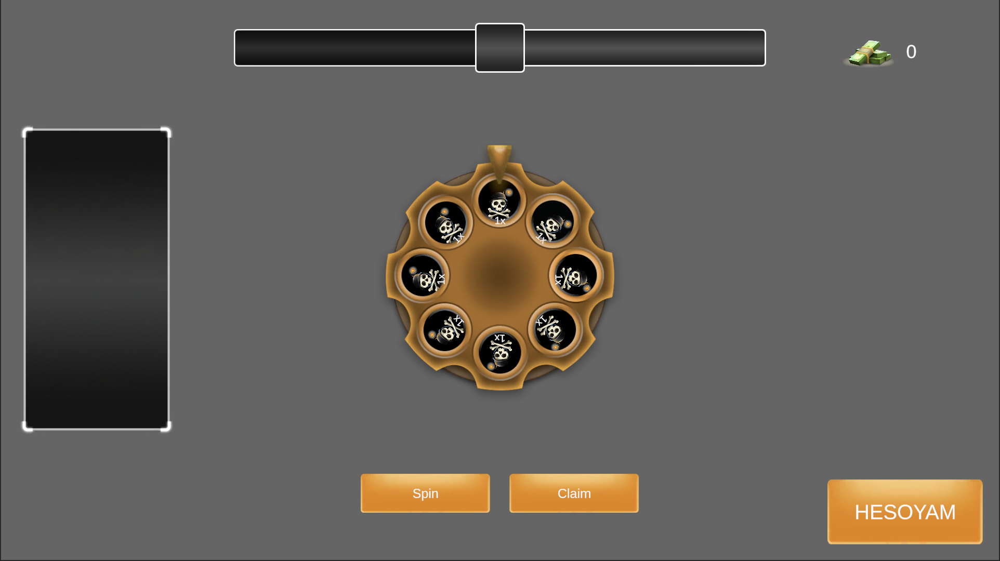
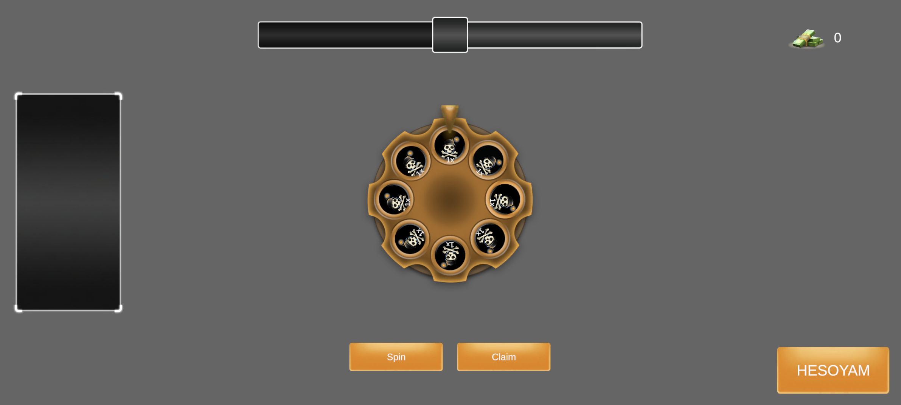
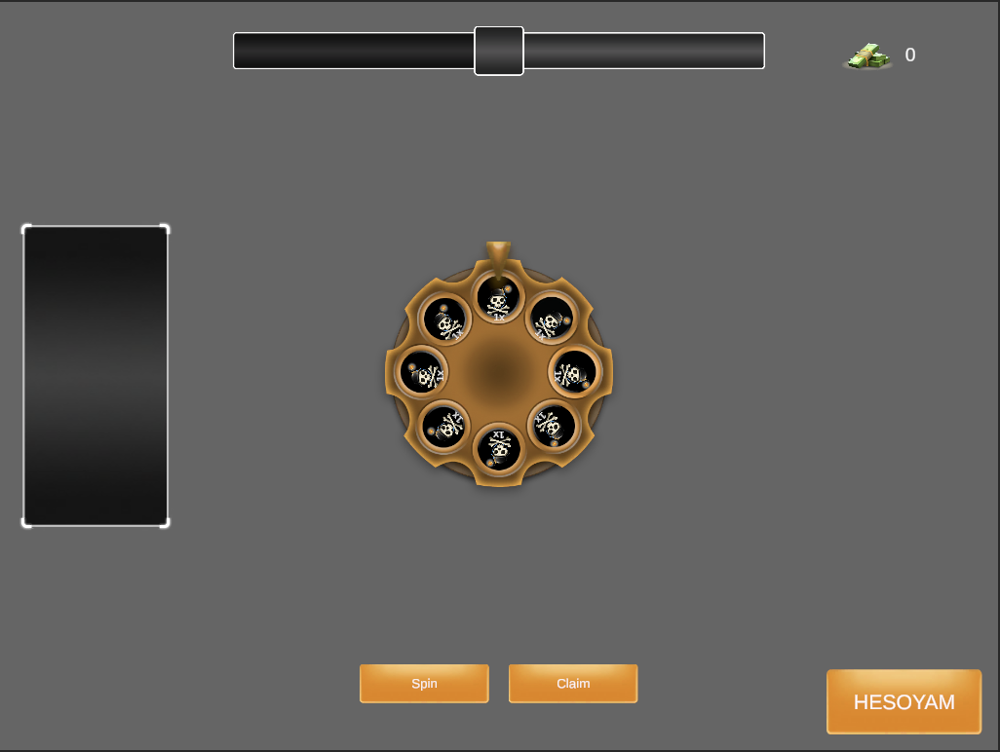

# Roulette

Roulette is a Unity 2021.3.45f2 prototype of a lane-based lucky wheel loop. The project focuses on data-driven progression and a lightweight state machine so that designers can quickly tweak reward probabilities, zone behaviour, and visual feedback without rewriting gameplay code. The codebase relies on Zenject for dependency injection, DOTween for UI motion, and TextMeshPro for text rendering.

## Media
- **Resolution checks** – Three captures document how the HUD anchors behave on common aspect ratios:  
   (standard widescreen),  (tall mobile), and  (tablet). Reference them when changing safe areas or layout groups.

## Requirements
- Unity **2021.3.45f2** (exact editor version from `ProjectSettings/ProjectVersion.txt`).
- [Zenject](https://github.com/modesttree/Zenject) (already embedded under `Assets`).
- [DOTween Pro/Free](https://assetstore.unity.com/packages/tools/animation/dotween-hotween-v2-27676); run the DOTween Utility Panel once after importing to generate setup scripts.
- TextMeshPro (automatically pulled in by Unity).

## Getting Started
1. Clone or download the repository and add the folder to Unity Hub.
2. Open the project in **Unity 2021.3.45f2**. Let the editor import the DOTween and Zenject packages when prompted.
3. Open `Assets/Scenes/SampleScene.unity`.
4. Ensure the ScriptableObject installers located in `Assets/ScriptableObjects/DI` are assigned to your `ProjectContext` / `SceneContext` (Player, Reward, Zone, WheelItem, ObjectPooler, Wheel). The default scene already references them.
5. Enter Play Mode. The wheel, player buttons, and zone panel prefabs demonstrate the entire flow.

## Project Layout
- `Assets/Scripts/Runtime/Game` – Core state machine (`Game`, `IGameState`, `PrepState`, `SpinState`, `RewardState`, `BombState`, `ClaimState`, `ExitState`, and `StateLookup`).
- `Assets/Scripts/Runtime/Zone` – Zone progression (`ZoneController`), ScriptableObject providers/effectors, and the UI widgets that visualise upcoming zones.
- `Assets/Scripts/Runtime/Wheel` – Wheel controller, installer, and UI (`WheelUI`, `WheelUISlot`, `WheelAnimSettings`).
- `Assets/Scripts/Runtime/Reward` – Reward generation (`RewardController`, `RewardCountData`, `RewardInventory`, `RewardUI`).
- `Assets/Scripts/Runtime/Player` – Economy, UI buttons, and installer.
- `Assets/Scripts/Runtime/ObjectPooler` – Generic pooling used by multiple UI widgets.
- `Assets/Scripts/Runtime/Popup` – Bomb popup feedback.
- `Assets/ScriptableObjects` – Designer-editable data (wheel items, zone providers, DI installers).
- `Assets/Prefabs` – UI prefabs (zone panel, reward slot, toggle button, etc.).

## Gameplay Workflow
1. **Boot / Prep (`PrepState`)**  
   - The `Game` component starts by switching to `PrepState`.  
   - `ZoneController` increments the current zone, fetches its data, and broadcasts it to UI.  
   - `RewardController` builds a `SpinInfo` payload filled with eight rewards (or seven rewards plus a bomb) based on the active zone. The wheel UI is populated and begins an idle animation.  
   - `PlayerChoiceController` toggles the Spin / Claim buttons depending on affordability (`PlayerEconomy`) and whether the current zone is claimable.
2. **Player Input**  
   - Clicking **Spin** changes the state to `SpinState`. Buttons are blocked to prevent double clicks.
   - Clicking **Claim** (when enabled) transitions to `ClaimState` (placeholder for payout + exit logic).
3. **Spinning (`SpinState`)**  
   - `WheelController` reads the `SpinInfo` to drive `WheelUI.AnimateSpin`.  
   - When the `WheelUI` animation finishes, an event determines whether the bomb slot was chosen. Depending on the result, the game switches to `BombState` (bomb slot) or `RewardState` (safe reward).
4. **Resolving Outcome**  
   - `BombState` shows `BombPopup`, waits for its tween to finish, then returns to `PrepState`.  
   - `RewardState` is the placeholder for feeding `RewardInventory`, animating reward slots, and eventually handing control back to `PrepState`.
5. **End-of-Run**  
   - `ClaimState` / `ExitState` are ready for implementing run completion and clean-up. `ZoneController.Reset` plus `RewardInventory.Clear` would typically live here.

The `StateLookup` static registry allows Zenject to construct each state as a singleton while still enabling lightweight `Game.ChangeState(...)` calls without resolving through the container every time.

## Key Systems & Design Choices
### State-driven flow
- `IGameState` keeps each phase (prep, spin, reward, bomb, claim, exit) isolated. This avoids deep monolithic update methods and clarifies when listeners should be wired/unwired.
- `Game.ChangeState` enforces the `OnExit → OnEnter` contract, ensuring tweens, listeners, and pooling behave deterministically.
- `StateLookup` is a deliberate compromise: it trades the ceremony of injecting every state into every consumer for a single static registry populated in each constructor (`StateLookup.PrepState = this;`). It fits the limited scope while keeping Zenject installers simple.

### Data-driven zones
- `ZoneProvider` ScriptableObjects abstract how zones are authored.  
  - `DirectZoneProvider` lets designers curate an explicit array.  
  - `ProceduralZoneProvider` seeds an array and pipes it through `ZoneDataEffector`s. A `ModulusEffector` can, for example, mark every fifth zone as Silver, claimable, and bombed.
- `ZoneController` exposes `IncreaseZone`, `TryGet`, and `OnNewZone` so other systems (wheel visuals, panel UI, rewards) always react to the same authoritative zone state.
- The zone UI is split into a **center panel** (`ZonePanelCenter`) that showcases the current zone and a **back panel** (`ZonePanelBack`) that queues the previously conquered zones. Both widgets pull their visuals from pooled prefabs to avoid per-frame instantiation.

### Reward generation & wheel presentation
- `WheelItemDatabase` keeps sprites, metadata, and UUIDs for every reward (including the bomb). `OnValidate` auto-fills GUIDs/names to minimise manual data mistakes.
- `RewardController` converts zone information into a `SpinInfo`: it samples items from `WheelItemDatabase` according to zone type and uses `RewardCountData` intervals (mapped by zone order) to roll stack sizes.
- `WheelController` is intentionally UI-agnostic. It forwards reward data to `WheelUI`, triggers idle/spin tweens, and exposes `OnSpinComplete` and `IsBombExploded` for states to react to the outcome.
- `WheelUI` handles the heavy lifting: it swaps background sprites per `ZoneType`, updates each `WheelUISlot` with the correct sprite/count, and calculates the rotation delta needed for the selected slot. Tweens are linked to the `animationTarget` so Unity automatically kills them when the object is disabled.

### Player economy & choices
- `PlayerEconomy` centralises the player’s balance and exposes `CheckAffordable`, `AddCash`, `SpendCash`, and a `UnityAction` event for UI.
- `PlayerChoiceController` owns the Spin/Claim buttons (`ToggleButton` instances). Each toggles its visuals, interactability, and click callback in one call to keep UI wiring simple.
- `PlayerInstaller` is a ScriptableObjectInstaller that spawns the starting `PlayerEconomy` and binds the `PlayerChoiceController` in the current scene.

### Inventory & claim preparation
- `RewardInventory` is a run-long ledger keyed by the reward UUID. It raises incremental `InventoryChange` payloads that the UI listens to, so the interface only animates deltas.
- `RewardUI` lazily instantiates slots (from pools) when new reward types are encountered and keeps a dictionary of `RewardUISlot` references for quick updates. `RewardInventoryViewer` demonstrates how to subscribe to inventory events.

### Object pooling for UI
- `PoolManager` is a thin wrapper around `UnityEngine.Pool.ObjectPool<T>`. Pools are registered through `PoolCreator<T>` which knows the prefab and `PoolSettings`.
- `PoolInstaller` (ScriptableObject) binds a single `PoolManager` and pre-registers pools for `RegularZoneViewer`, `ZoneCenterViewer`, `RewardUISlot`, and `ToggleButton`. Prefabs stay inactive in the scene hierarchy, but retrieving and releasing them is one method call, reducing GC and instantiation spikes when zones advance quickly.

### Feedback & polish
- DOTween drives almost all UI motion: wheel rotation, button squash, counter roll-ups, panel slides, and the bomb popup fade. Every tween uses `SetLink`/`SetTarget`, making it resilient to hierarchy changes or destruction.
- `BombPopup` provides a quick negative feedback loop: it fades in/out twice, then hides itself and notifies `BombState` that the animation is over.
- `TweenUtil.DORightPadding` is a helper extension for animating horizontal layout padding because Unity’s layout system is otherwise hard to tween smoothly.

### Dependency Injection
- All runtime singletons are registered through Zenject installers:
  - `GameInstaller` binds every `IGameState` implementation plus the `Game` MonoBehaviour.
  - ScriptableObject installers in `Assets/ScriptableObjects/DI/*` bind Player, Reward, Zone, WheelItem, Wheel, Popup, and ObjectPooler services.
- This approach decouples scene objects from data assets: designers can clone installers with alternate configurations (new zone providers, different pool sizes, another starting cash value) and swap them without touching scripts.

## Editing Data & Extending the Loop
1. **Wheel Items** – Edit `Assets/ScriptableObjects/WheelItem/WheelItemDatabase.asset`. Adding sprites and setting their `WheelItemType` is enough; GUIDs auto-populate in `OnValidate`.
2. **Reward distribution** – In `RewardInstaller.asset`, tweak the `RewardCountData` array. Each element matches a display order (index) and sets the `[min, max]` count per rarity.
3. **Zones** – Choose between `DirectZoneProvider` (manual array) or `ProceduralZoneProvider` + `ZoneDataEffector`s (e.g., multiple `ModulusEffector` assets to sprinkle hazards). Assign the asset in `ZoneInstaller.asset`.
4. **Player economy** – Update `startAmount` inside `PlayerInstaller.asset`, or expose additional knobs (spin cost is serialized in the `Game` MonoBehaviour).
5. **UI visuals** –  
   - Wheel: edit the `WheelUI` component’s `WheelVisualData` array and `WheelAnimSettings`.  
   - Zone panels: change the `ZoneCenterVisualData` arrays on `ZoneCenterViewer` / `RegularZoneViewer` prefabs.  
   - Rewards: modify the `RewardUISlot` prefab used by the pool installer.  
   - Buttons: tweak sprites and animation settings on the `ToggleButton` prefab.
6. **Adding new states** – Implement `IGameState`, bind it in `GameInstaller`, register it inside `StateLookup`, and transition to it using `Game.ChangeState`.

When implementing Claim / Reward resolution, feed the rolled `SpinInfo.rewards[winnerIndex]` to `RewardInventory`, animate the matching `RewardUISlot`, pay out via `PlayerEconomy.AddCash`, and finally call `Game.ChangeState(StateLookup.PrepState)` to continue the run.

